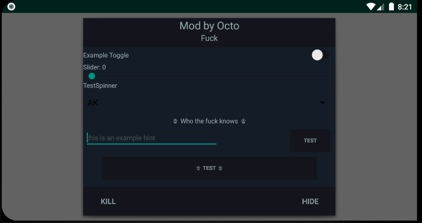

# Hooking-Template-With-Mod-Menu

This is a simple template for the usage of Cydia Substrate and And64InlineHook with a Mod Menu written in Java.

### Setup:
* Folllow this tutorial: https://piin.dev/showthread.php?tid=3

### Implementation:
* https://piin.dev/showthread.php?tid=9
* Read this tutorial carefully 

### Tutorial:
* https://guidedhacking.com/threads/function-pointers-and-a-tutorial-for-my-hooking-template.14771/#post-90490

### Layout:
This is how the menu looks like when you simply build and run it 

### Credits:
This template should support x64 hooking now thanks to this repo:
https://github.com/Rprop/And64InlineHook
